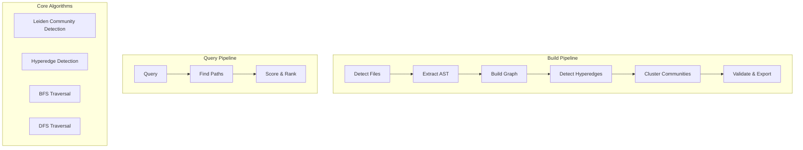

# Garfield

**Build knowledge graphs from source code** - A Rust-native code analysis tool that extracts, analyzes, and visualizes relationships in your codebase.

## What is Garfield?

Garfield is a lightweight code analysis tool that builds **knowledge graphs** from source code. Unlike traditional tools that just find text, Garfield understands the structure of your code:

- **Functions** that call other functions
- **Classes** that define structures and methods
- **Modules** that group related code
- **Hyperedges** - groups of 3+ nodes working together

### Key Features

- **17+ Languages Supported**: Rust, Python, Ruby, Java, Go, JavaScript, TypeScript, C, C++, Scala, Bash, Lua, PHP, Zig, Elixir, Kotlin, Swift
- **No LLM Required**: Pure extraction-based analysis
- **Incremental Builds**: Only re-analyze changed files
- **Community Detection**: Leiden algorithm finds code clusters
- **Hyperedge Detection**: 4 algorithms to find related code groups
- **Query Interface**: Search and navigate your codebase
- **Graph Export**: JSON output for integration with other tools

## Architecture



## Algorithms

### 1. Leiden Community Detection

**Purpose**: Group related code entities into communities.

Garfield uses the **Leiden algorithm** (VTraag et al., 2018) - an optimized version of Louvain that guarantees well-connected communities.

```
Leiden = Louvain + Refinement Phase
```

**How it works**:
1. **Phase 1 (Local Move)**: Move each node to the community that gives the best modularity gain
2. **Phase 2 (Refinement)**: Ensure communities are well-connected subgraphs
3. **Phase 3 (Aggregation)**: Build new network at community level and repeat

**Modularity Gain Formula**:
```
ΔQ = (Σ_in - Σ_out) / m - k_i × (Σ_total - k_i) / m²
```

Where:
- `Σ_in`: sum of weights to target community
- `Σ_out`: sum of weights from current community  
- `m`: total edge weights
- `k_i`: node weight (degree)
- `Σ_total`: target community weight

**Complexity**: O(n log n) average case

### 2. Hyperedge Detection

**Purpose**: Find groups of 3+ nodes that work together.

Garfield uses **4 algorithms** (no LLM required):

#### Algorithm 1: File-Based (O(n))
```rust
Group nodes by source file → if ≥3 nodes in same file → hyperedge
```
- Fastest method
- Best for monolithic files with many functions

#### Algorithm 2: Call Chain (O(n²))
```rust
Find paths: A→B→C→D → hyperedge(A, B, C, D)
```
- Finds sequential call patterns
- Good for pipeline-like code

#### Algorithm 3: Config Pattern (O(n))
```rust
Detect: Kubernetes, Docker, Terraform patterns → extract module names
```
- Domain-specific detection
- Works with infrastructure-as-code

#### Algorithm 4: Directory-Based (O(n))
```rust
src/auth/*.rs → "auth" module
src/api/v1/*.rs → "api/v1" module
```
- Cross-file grouping
- Best for organized projects

### 3. Graph Traversal

#### BFS (Breadth-First Search)
- **Use**: Find closest relationships, explore all possibilities at same level
- **Complexity**: O(V + E)
- **Best for**: Shortest path, level-by-level exploration

#### DFS (Depth-First Search)  
- **Use**: Deep exploration, finding complete paths
- **Complexity**: O(V + E)
- **Best for**: Deep call stacks, complete dependency chains

### 4. Confidence Scoring

Edges have confidence levels based on extraction method:

| Confidence | Score | Source |
|------------|-------|--------|
| Extracted | 1.0 | Directly parsed from AST |
| Inferred | 0.75 | Pattern-matched or call analysis |
| Ambiguous | 0.2 | Guessed from naming conventions |

## Flow

### Build Flow

```
$ garfield build ./src --output garfield-out

1. DETECT    → Find all code files (.rs, .py, .js, etc.)
2. EXTRACT   → Parse AST, extract functions/classes/imports
3. BUILD     → Create nodes and edges from extraction
4. HYPEREDGE → Detect code groups using 4 algorithms
5. COMMUNITY → Run Leiden to find communities
6. VALIDATE  → Check graph integrity
7. EXPORT    → Save graph.json + GRAPH_REPORT.md
```

### Query Flow

```
$ garfield query "user authentication" --graph garfield-out/graph.json

1. MATCH   → Find nodes matching query terms
2. EXPAND  → Traverse BFS/DFS up to depth limit
3. SCORE   → Rank results by relevance
4. FORMAT  → Return top N results with paths
```

## Installation

### Prerequisites

- Rust 1.70+ (install via [rustup](https://rustup.rs/))

### Build

```bash
git clone https://github.com/yourusername/garfield.git
cd garfield
cargo build --release

# Binary at target/release/garfield
sudo cp target/release/garfield /usr/local/bin/
```

### Usage

#### Build a graph from your code:

```bash
# Full build
garfield build ./src --output garfield-out

# Incremental update (only changed files)
garfield build ./src --update
```

#### Query the graph:

```bash
# Basic query
garfield query "find_user" --graph garfield-out/graph.json

# With filters
garfield query "auth" --node-type function --community 5 --graph garfield-out/graph.json

# Deep search
garfield query "database" --depth 5 --budget 5000 --graph garfield-out/graph.json
```

#### Find paths between code:

```bash
garfield path "main" "database" --graph garfield-out/graph.json
```

#### Explain a specific node:

```bash
garfield explain "fn_process_request" --graph garfield-out/graph.json
```

## Project Structure

```
garfield/
├── src/
│   ├── lib.rs           # Core library + run_build/run_query
│   ├── main.rs          # CLI interface
│   ├── extract.rs       # AST extraction (tree-sitter)
│   ├── build.rs         # Graph construction
│   ├── leiden.rs        # Community detection
│   ├── hyperedge.rs     # Hyperedge detection (4 algorithms)
│   ├── analyze.rs       # Graph analysis (god nodes, cohesion)
│   ├── serve.rs         # Query engine
│   ├── cache.rs         # Incremental build cache
│   ├── lang.rs          # Language configurations
│   ├── types.rs         # Data structures
│   ├── report.rs        # Report generation
│   └── ...
├── tests/
│   ├── integration_*.rs  # Integration tests
│   └── e2e_*.rs         # End-to-end tests
└── Cargo.toml
```

## Testing

```bash
# Run all tests
cargo test

# Run with coverage
cargo test -- --nocapture

# Run specific test
cargo test test_leiden
```

## Output

### graph.json

```json
{
  "nodes": [
    {
      "id": "src/main.rs:authenticate_user",
      "label": "authenticate_user",
      "source_file": "src/main.rs",
      "source_location": "src/main.rs @ L42",
      "community": 5,
      "node_type": "function"
    }
  ],
  "links": [
    {
      "source": "src/main.rs:authenticate_user",
      "target": "src/db.rs:get_user",
      "relation": "calls",
      "confidence": "Extracted",
      "confidence_score": 1.0
    }
  ],
  "hyperedges": [
    {
      "id": "auth_module",
      "label": "auth module",
      "nodes": ["login", "logout", "verify_token"],
      "relation": "module",
      "confidence_score": 0.85
    }
  ]
}
```

### GRAPH_REPORT.md

Generated automatically with:
- God nodes (most connected entities)
- Community statistics
- Surprising connections
- Confidence breakdown

## Language Support

| Language | Extensions | Parser |
|----------|------------|--------|
| Rust | .rs | tree-sitter-rust |
| Python | .py | tree-sitter-python |
| JavaScript | .js, .mjs | tree-sitter-javascript |
| TypeScript | .ts, .tsx | tree-sitter-typescript |
| Go | .go | tree-sitter-go |
| Java | .java | tree-sitter-java |
| Ruby | .rb | tree-sitter-ruby |
| C | .c, .h | tree-sitter-c |
| C++ | .cpp, .hpp | tree-sitter-cpp |
| Scala | .scala | tree-sitter-scala |
| Bash | .sh | tree-sitter-bash |
| Lua | .lua | tree-sitter-lua |
| PHP | .php | tree-sitter-php |
| Zig | .zig | tree-sitter-zig |
| Elixir | .ex, .exs | tree-sitter-elixir |
| Kotlin | .kt, .kts | tree-sitter-kotlin |
| Swift | .swift | tree-sitter-swift |

## Performance

- **File Detection**: ~1ms per file
- **AST Extraction**: ~5-50ms per file (language dependent)
- **Graph Build**: O(n) where n = number of nodes
- **Leiden Clustering**: O(n log n) average
- **Query**: O(budget) with early termination

## License

MIT License - see LICENSE file for details.

## References

- Traag, V.A., Waltman, L., & van Eck, N.J. (2018). From Louvain to Leiden: guaranteeing well-connected communities. *Scientific Reports*, 8, 11668.
- Blondel, V.D., et al. (2008). Fast unfolding of communities in large networks. *Journal of Statistical Mechanics*.
