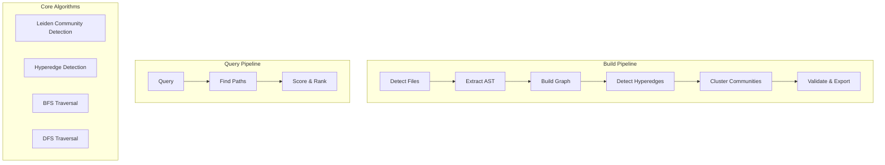

# Garfield

**Xây dựng knowledge graphs từ source code** - Công cụ phân tích code bằng Rust, giúp trích xuất, phân tích và trực quan hóa các mối quan hệ trong codebase của bạn.

## Garfield là gì?

Garfield là công cụ phân tích code nhẹ, xây dựng **knowledge graphs** từ source code. Khác với các công cụ truyền thống chỉ tìm text, Garfield hiểu cấu trúc code của bạn:

- **Functions** gọi các functions khác
- **Classes** định nghĩa structures và methods
- **Modules** nhóm các code liên quan
- **Hyperedges** - nhóm 3+ nodes làm việc cùng nhau

### Tính năng chính

- **17+ Ngôn ngữ**: Rust, Python, Ruby, Java, Go, JavaScript, TypeScript, C, C++, Scala, Bash, Lua, PHP, Zig, Elixir, Kotlin, Swift
- **Không cần LLM**: Phân tích dựa trên extraction thuần túy
- **Incremental Builds**: Chỉ phân tích lại các file đã thay đổi
- **Community Detection**: Thuật toán Leiden tìm code clusters
- **Hyperedge Detection**: 4 thuật toán tìm nhóm code liên quan
- **Query Interface**: Tìm kiếm và điều hướng codebase
- **Graph Export**: Output JSON để tích hợp với công cụ khác

## Kiến trúc



## Các thuật toán

### 1. Leiden Community Detection

**Mục đích**: Nhóm các code entities liên quan thành communities.

Garfield sử dụng **thuật toán Leiden** (VTraag et al., 2018) - phiên bản tối ưu của Louvain, đảm bảo các communities được kết nối tốt.

```
Leiden = Louvain + Refinement Phase
```

**Cách hoạt động**:
1. **Phase 1 (Local Move)**: Di chuyển mỗi node sang community cho modularity gain tốt nhất
2. **Phase 2 (Refinement)**: Đảm bảo communities là các subgraphs được kết nối tốt
3. **Phase 3 (Aggregation)**: Xây dựng network mới ở cấp độ community và lặp lại

**Công thức Modularity Gain**:
```
ΔQ = (Σ_in - Σ_out) / m - k_i × (Σ_total - k_i) / m²
```

Trong đó:
- `Σ_in`: tổng trọng số đến target community
- `Σ_out`: tổng trọng số từ current community  
- `m`: tổng trọng số edges
- `k_i`: trọng số node (degree)
- `Σ_total`: trọng số target community

**Độ phức tạp**: O(n log n) trung bình

### 2. Hyperedge Detection

**Mục đích**: Tìm nhóm 3+ nodes làm việc cùng nhau.

Garfield sử dụng **4 thuật toán** (không cần LLM):

#### Thuật toán 1: File-Based (O(n))
```rust
Group nodes by source file → nếu ≥3 nodes cùng file → hyperedge
```
- Phương pháp nhanh nhất
- Tốt cho các file lớn với nhiều functions

#### Thuật toán 2: Call Chain (O(n²))
```rust
Find paths: A→B→C→D → hyperedge(A, B, C, D)
```
- Tìm các call patterns tuần tự
- Tốt cho code dạng pipeline

#### Thuật toán 3: Config Pattern (O(n))
```rust
Detect: Kubernetes, Docker, Terraform patterns → extract module names
```
- Detection theo domain cụ thể
- Hoạt động với infrastructure-as-code

#### Thuật toán 4: Directory-Based (O(n))
```rust
src/auth/*.rs → "auth" module
src/api/v1/*.rs → "api/v1" module
```
- Nhóm cross-file
- Tốt nhất cho các project có tổ chức tốt

### 3. Graph Traversal

#### BFS (Breadth-First Search)
- **Use**: Tìm relationships gần nhất, explore tất cả possibilities cùng level
- **Độ phức tạp**: O(V + E)
- **Tốt cho**: Shortest path, level-by-level exploration

#### DFS (Depth-First Search)  
- **Use**: Deep exploration, tìm complete paths
- **Độ phức tạp**: O(V + E)
- **Tốt cho**: Deep call stacks, complete dependency chains

### 4. Confidence Scoring

Edges có confidence levels dựa trên phương pháp extraction:

| Confidence | Score | Nguồn |
|------------|-------|--------|
| Extracted | 1.0 | Directly parsed từ AST |
| Inferred | 0.75 | Pattern-matched hoặc call analysis |
| Ambiguous | 0.2 | Đoán từ naming conventions |

## Flow

### Build Flow

```
$ garfield build ./src --output garfield-out

1. DETECT    → Tìm tất cả code files (.rs, .py, .js, etc.)
2. EXTRACT   → Parse AST, trích xuất functions/classes/imports
3. BUILD     → Tạo nodes và edges từ extraction
4. HYPEREDGE → Detect code groups sử dụng 4 thuật toán
5. COMMUNITY → Chạy Leiden để tìm communities
6. VALIDATE  → Check graph integrity
7. EXPORT    → Lưu graph.json + GRAPH_REPORT.md
```

### Query Flow

```
$ garfield query "user authentication" --graph garfield-out/graph.json

1. MATCH   → Tìm nodes matching query terms
2. EXPAND  → Traverse BFS/DFS đến depth limit
3. SCORE   → Rank results by relevance
4. FORMAT  → Return top N results với paths
```

## Cài đặt

### Yêu cầu

- Rust 1.70+ (cài qua [rustup](https://rustup.rs/))

### Build

```bash
git clone https://github.com/yourusername/garfield.git
cd garfield
cargo build --release

# Binary tại target/release/garfield
sudo cp target/release/garfield /usr/local/bin/
```

### Sử dụng

#### Build graph từ code của bạn:

```bash
# Full build
garfield build ./src --output garfield-out

# Incremental update (chỉ các file đã thay đổi)
garfield build ./src --update
```

#### Query graph:

```bash
# Basic query
garfield query "find_user" --graph garfield-out/graph.json

# Với filters
garfield query "auth" --node-type function --community 5 --graph garfield-out/graph.json

# Deep search
garfield query "database" --depth 5 --budget 5000 --graph garfield-out/graph.json
```

#### Tìm paths giữa các code entities:

```bash
garfield path "main" "database" --graph garfield-out/graph.json
```

#### Explain một node cụ thể:

```bash
garfield explain "fn_process_request" --graph garfield-out/graph.json
```

## Cấu trúc Project

```
garfield/
├── src/
│   ├── lib.rs           # Core library + run_build/run_query
│   ├── main.rs          # CLI interface
│   ├── extract.rs       # AST extraction (tree-sitter)
│   ├── build.rs         # Graph construction
│   ├── leiden.rs        # Community detection
│   ├── hyperedge.rs     # Hyperedge detection (4 algorithms)
│   ├── analyze.rs       # Graph analysis (god nodes, cohesion)
│   ├── serve.rs         # Query engine
│   ├── cache.rs         # Incremental build cache
│   ├── lang.rs          # Language configurations
│   ├── types.rs         # Data structures
│   ├── report.rs        # Report generation
│   └── ...
├── tests/
│   ├── integration_*.rs  # Integration tests
│   └── e2e_*.rs         # End-to-end tests
└── Cargo.toml
```

## Testing

```bash
# Chạy tất cả tests
cargo test

# Chạy với coverage
cargo test -- --nocapture

# Chạy specific test
cargo test test_leiden
```

## Output

### graph.json

```json
{
  "nodes": [
    {
      "id": "src/main.rs:authenticate_user",
      "label": "authenticate_user",
      "source_file": "src/main.rs",
      "source_location": "src/main.rs @ L42",
      "community": 5,
      "node_type": "function"
    }
  ],
  "links": [
    {
      "source": "src/main.rs:authenticate_user",
      "target": "src/db.rs:get_user",
      "relation": "calls",
      "confidence": "Extracted",
      "confidence_score": 1.0
    }
  ],
  "hyperedges": [
    {
      "id": "auth_module",
      "label": "auth module",
      "nodes": ["login", "logout", "verify_token"],
      "relation": "module",
      "confidence_score": 0.85
    }
  ]
}
```

### GRAPH_REPORT.md

Tự động generate với:
- God nodes (entities được kết nối nhiều nhất)
- Community statistics
- Surprising connections
- Confidence breakdown

## Ngôn ngữ được hỗ trợ

| Ngôn ngữ | Extensions | Parser |
|----------|------------|--------|
| Rust | .rs | tree-sitter-rust |
| Python | .py | tree-sitter-python |
| JavaScript | .js, .mjs | tree-sitter-javascript |
| TypeScript | .ts, .tsx | tree-sitter-typescript |
| Go | .go | tree-sitter-go |
| Java | .java | tree-sitter-java |
| Ruby | .rb | tree-sitter-ruby |
| C | .c, .h | tree-sitter-c |
| C++ | .cpp, .hpp | tree-sitter-cpp |
| Scala | .scala | tree-sitter-scala |
| Bash | .sh | tree-sitter-bash |
| Lua | .lua | tree-sitter-lua |
| PHP | .php | tree-sitter-php |
| Zig | .zig | tree-sitter-zig |
| Elixir | .ex, .exs | tree-sitter-elixir |
| Kotlin | .kt, .kts | tree-sitter-kotlin |
| Swift | .swift | tree-sitter-swift |

## Performance

- **File Detection**: ~1ms per file
- **AST Extraction**: ~5-50ms per file (phụ thuộc ngôn ngữ)
- **Graph Build**: O(n) với n = số nodes
- **Leiden Clustering**: O(n log n) trung bình
- **Query**: O(budget) với early termination

## License

MIT License - xem LICENSE file để biết thêm chi tiết.

## Tham khảo

- Traag, V.A., Waltman, L., & van Eck, N.J. (2018). From Louvain to Leiden: guaranteeing well-connected communities. *Scientific Reports*, 8, 11668.
- Blondel, V.D., et al. (2008). Fast unfolding of communities in large networks. *Journal of Statistical Mechanics*.
